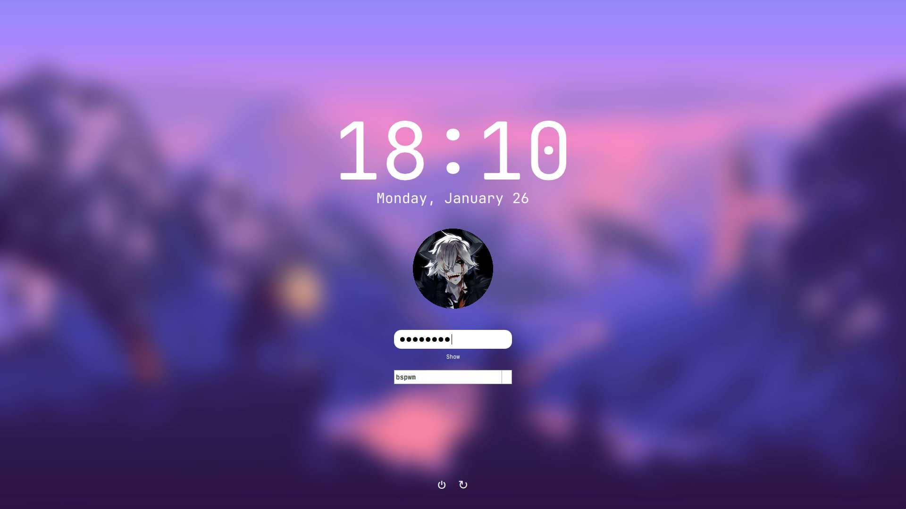
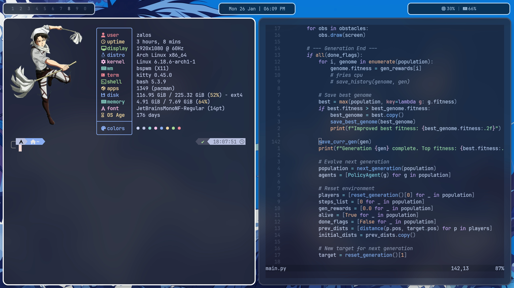
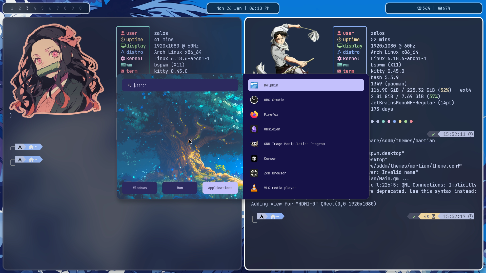

<p align="center">
  <video src="./assets/rice.webm" width="900" autoplay loop muted playsinline></video>
</p>

<h1 align="center">🪐 Martian Dotfiles</h1>

---

> [!WARNING]
> Works best for **Arch Linux**.  
> For other distros you would have to install packages yourself 

## ⚙️ Get Started
- Clone repo
```
git clone git@github.com:zalosspace/martian_dotfiles.git && \
cd martian_dotfiles
```
- Run install.sh 
```
sh install.sh
```
---

## 📸 Screenshots

|  |  |
|--------------------------|--------------------------|
|  |  |

## 🧩 What’s Inside

- **Window Manager:** `bspwm` 
- **Hotkeys:** `sxhkd`
- **Status Bar:** `polybar` 
- **App Launcher:** `rofi` 
- **Compositor:** `picom` 
- **Shell:** `zsh`
- **Terminal:** `kitty`
